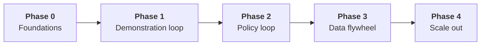

# Roadmap

Phases are ordered by dependency, not by date. A phase is done when its exit criteria hold, and the next phase can start before every item in the previous one is polished.

## Phase 0 — Foundations

- This repo: architecture, contracts v0, conventions, ADR process
- GitHub rulesets and repo settings applied to every repo ([conventions/github.md](conventions/github.md))
- `data`, `teleop`, `inference` scaffolded to [conventions/repositories.md](conventions/repositories.md) with CI running lint and tests

**Exit:** every repo has a protected `main`, a README, an AGENTS.md and a green CI run. The open decisions below marked *Phase 0* are recorded as ADRs.

## Phase 1 — Demonstration loop

- One reference embodiment described by a C1 Embodiment spec
- C2 Robot interface for that embodiment, both real and sim
- `teleop` drives it through C3 and the Recorder writes C4 Episodes
- `data` ingests and validates episodes and publishes a versioned C5 Dataset

**Exit:** an operator records N episodes, and `data` produces a dataset version from them with zero manual file handling.

## Phase 2 — Policy loop

- A training pipeline turns a C5 Dataset into a C6 Policy artifact with full provenance
- `inference` loads the artifact, checks embodiment compatibility, and runs it through the same C2 interface
- An evaluation protocol: fixed task set, success metric, reported per artifact

**Exit:** a policy trained only on Phase 1 data completes the reference task at a measured success rate, and the result links back to the exact dataset version and commit.

## Phase 3 — Data flywheel

- Arbiter lets an operator take over a running policy; the interleaved episode is recorded with per-step controller source
- `data` curates rollouts and interventions into new dataset versions
- Retraining from those versions is a routine, repeatable run

**Exit:** one full turn of the loop (deploy → intervene → curate → retrain → re-evaluate) shows a measured improvement.

## Phase 4 — Scale out

- Multiple embodiments behind the same contracts
- Sim/real parity checks as part of evaluation
- Dataset and artifact storage sized for continuous collection

## Open decisions

Each becomes an ADR in [`decisions/`](decisions/) when settled.

| Decision | Needed by | Question |
| --- | --- | --- |
| Contract home | Phase 0 | Separate `core` repo/package for C1–C4, or vendored into each layer? |
| Training ownership | Phase 2 | New `training` repo, or part of `inference`? |
| Runtime middleware | Phase 1 | What carries C2/C3 at runtime (e.g. ROS 2, plain Python, a custom IPC)? |
| Episode / dataset format | Phase 1 | Which on-disk format implements C4/C5? |
| Storage | Phase 1 | Where datasets and policy artifacts live, and how they are versioned |
| Language and packaging | Phase 0 | Primary language(s), package manager, minimum versions |
| License | Phase 0 | Internal only, or open-source any layer? |
