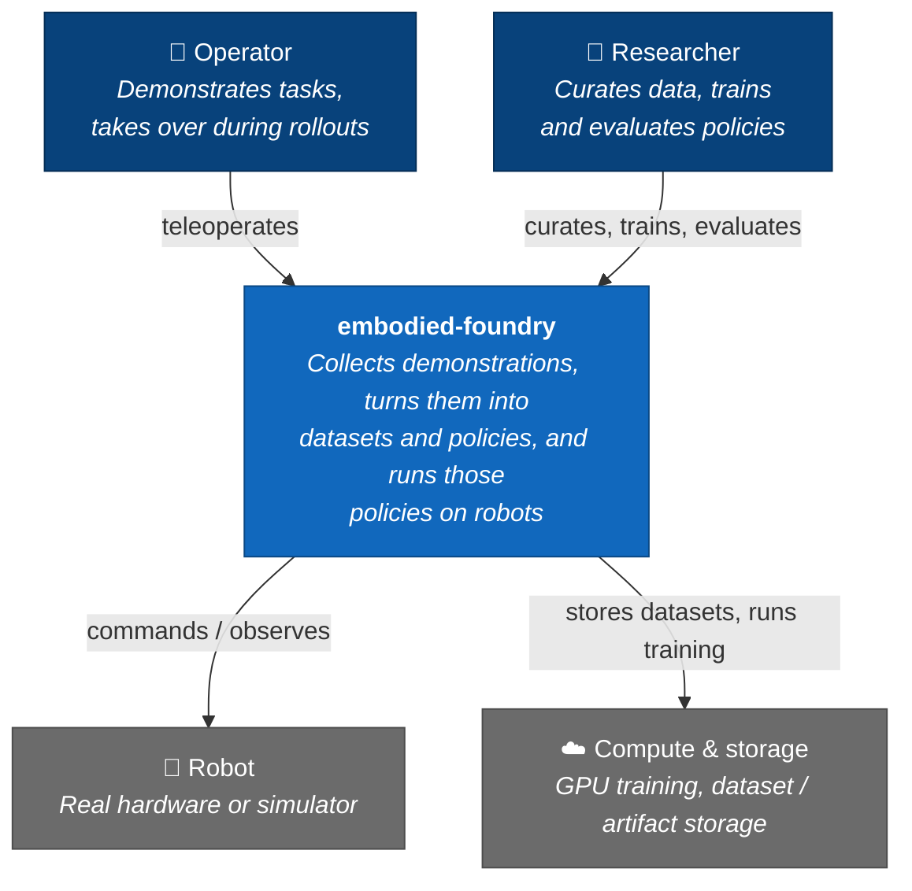
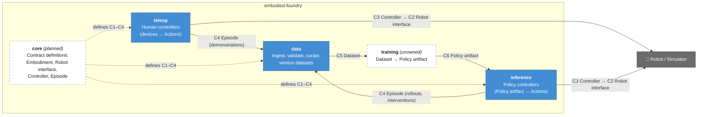
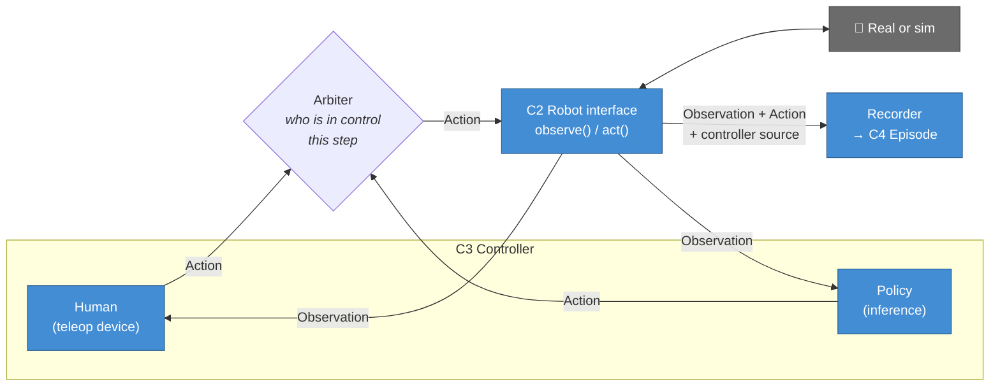
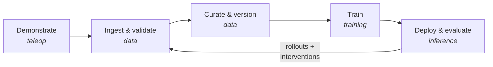

# Architecture

Org-level architecture of embodied-foundry, drawn with the [C4 model](https://c4model.com) in Mermaid ([ADR-0002](../decisions/0002-diagrams-as-code-mermaid-c4.md)). This repo owns levels 1–2 (context, containers). Level 3+ (components inside a layer) lives in each layer repo and links back here.

| Doc | Covers |
| --- | --- |
| This page | System context, layers, the demonstration → policy → rollout loop |
| [contracts.md](contracts.md) | The six cross-layer contracts and the physical conventions they share |

## Level 1 — System context

## Level 2 — Layers

Each box is a repository. Arrows are labelled with the contract that crosses the boundary ([contracts.md](contracts.md)).

Dashed boxes do not exist yet. Both are open decisions on the [roadmap](../ROADMAP.md#open-decisions).

## The key design choice: teleop and inference are interchangeable controllers

A human operator and a trained policy do the same job: read an observation and emit an action for the same robot. Both implement one **Controller** contract (C3) against one **Robot interface** (C2), and recording is a sink on that interface, not a teleop feature.

What this buys us:

- **Same episode format for demos and rollouts.** `data` needs one ingest path, and every episode records which controller acted at each step.
- **Human intervention for free.** Taking over a running policy only means switching the arbiter's source. The interleaved episode is exactly the training signal that intervention-based learning needs (Phase 3 on the roadmap).
- **Sim/real parity.** A simulator is just another Robot interface implementation, so teleop and inference code do not branch on sim vs. real.

## The loop

