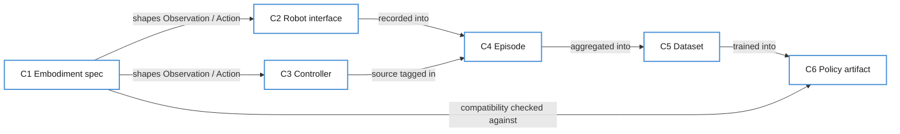

# Cross-layer contracts

Layers depend on these contracts, never on each other's internals. This page defines *what* each contract must carry. Wire formats and libraries are chosen per contract by ADR once a layer needs them.

| ID | Contract | Produced by | Consumed by |
| --- | --- | --- | --- |
| C1 | Embodiment spec | core | all |
| C2 | Robot interface | robot drivers, simulators | teleop, inference |
| C3 | Controller | teleop, inference | Robot interface (via arbiter) |
| C4 | Episode | Recorder | data |
| C5 | Dataset | data | training |
| C6 | Policy artifact | training | inference |

## C1 — Embodiment spec

Describes one robot configuration, so every other contract can be checked against it.

- Stable identifier and version
- Action space: per-dimension name, unit, limits, control mode (joint position, joint velocity, end-effector pose, gripper, …)
- Observation streams: proprioception fields, each camera (name, resolution, mounting frame), other sensors
- Control rate and per-stream sample rates
- Kinematic description reference (URDF/MJCF/USD) and frame tree

## C2 — Robot interface

The only way anything talks to a robot, real or simulated.

- `observe() → Observation` and `act(Action)` at the embodiment's control rate
- Lifecycle: connect, reset/home, emergency stop, disconnect
- Reports the Embodiment spec (C1) it implements

## C3 — Controller

- `step(Observation) → Action`, plus `reset()` at episode boundaries
- Declares its source kind (`human` or `policy`) and an identifier (operator device, or Policy artifact ID)

## C4 — Episode

One contiguous run on one embodiment, recorded by the same Recorder whether a human or policy was acting.

- Time-aligned observation and action streams
- Per-step controller source (supports mid-episode human takeover)
- Metadata: embodiment spec ID + version, task description, operator/policy IDs, outcome label, start/end time, software versions of every layer involved

## C5 — Dataset

- Immutable once published; changes produce a new version
- Manifest listing episodes and the filters/curation that selected them
- Normalization statistics computed over the dataset
- Embodiment spec(s) covered

## C6 — Policy artifact

- Weights and model config
- Normalization statistics used at training time
- Embodiment spec ID + version it is valid for (inference refuses to load it on a mismatch)
- Provenance: Dataset version, training code commit, training config

## Physical and data conventions

These apply everywhere, so no layer has to guess.

| Topic | Convention |
| --- | --- |
| Units | SI: meters, radians, seconds, kilograms, newtons |
| Rotations | Quaternions stored `(x, y, z, w)`; Euler angles never cross a contract |
| Frames | Right-handed; frame names come from the Embodiment spec's frame tree; poses always name their parent frame |
| Time | Each sample carries a monotonic timestamp (ns) for alignment; episodes also record UTC wall-clock start |
| Images | Row-major, RGB channel order, `uint8` at the contract boundary |
| Naming | `snake_case` for fields and stream names |

## Changing a contract

Contracts are versioned with semver. A breaking change (removing or renaming a field, changing a unit or meaning) needs an ADR in [`decisions/`](../decisions/) and approval from an owner of every consuming layer.
