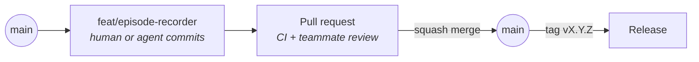

# Git workflow

Trunk-based: `main` is always releasable, and all work happens on short-lived branches merged through pull requests.

## Branches

`<type>/<short-kebab-description>`, where `<type>` is a Conventional Commit type: `feat/`, `fix/`, `docs/`, `refactor/`, `test/`, `chore/`, `ci/`. Agent branches use the same pattern ([ai-agents.md](ai-agents.md)).

## Commits

[Conventional Commits](https://www.conventionalcommits.org) **without a scope**: `feat: add episode recorder`, not `feat(data): …`. The repo already provides the scope. One concern per commit.

Mark breaking changes with `!` (`feat!: rename action field`) and a `BREAKING CHANGE:` footer.

## Pull requests

- The PR title is a Conventional Commit, because it becomes the squash commit on `main`.
- One concern per PR. Split stacked work into sequential PRs.
- Only squash merging is allowed. The branch is deleted on merge.
- Review requirements are enforced by rulesets ([github.md](github.md)).

## Versioning and releases

[Semantic Versioning](https://semver.org). Tag `main` with `vX.Y.Z`. Release tags cannot be moved or deleted. Contract versions follow the same rules ([contracts.md](https://github.com/embodied-foundry/architecture/blob/main/contracts.md#changing-a-contract)).
